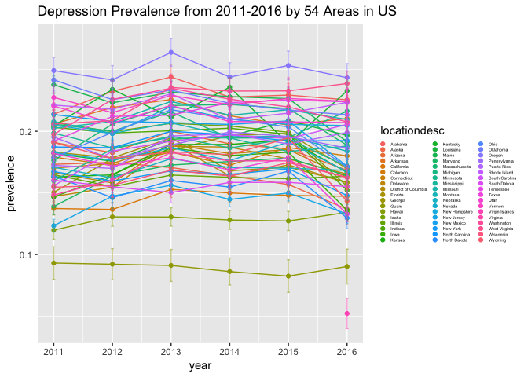
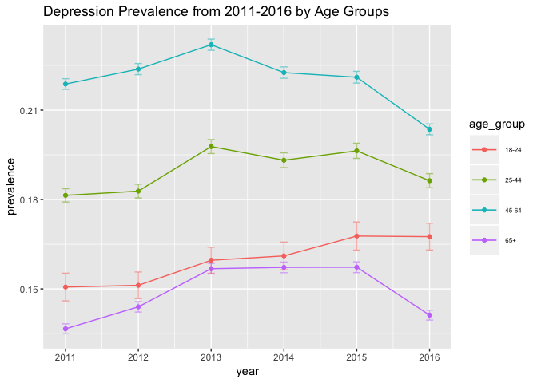
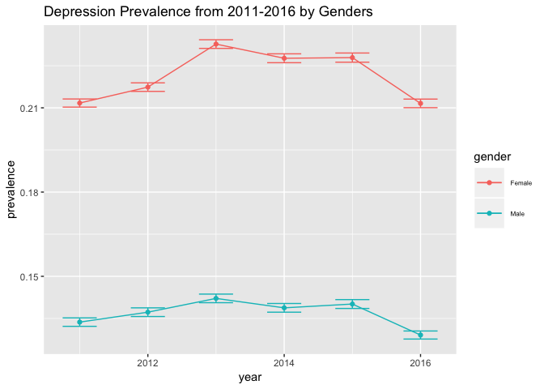
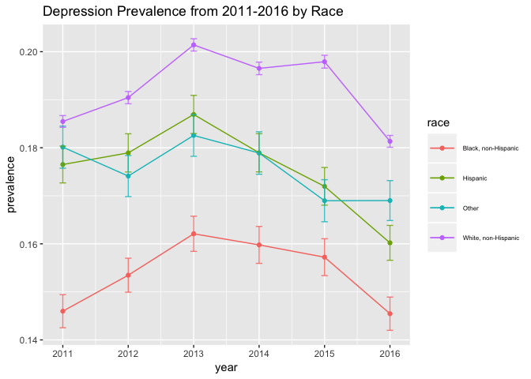
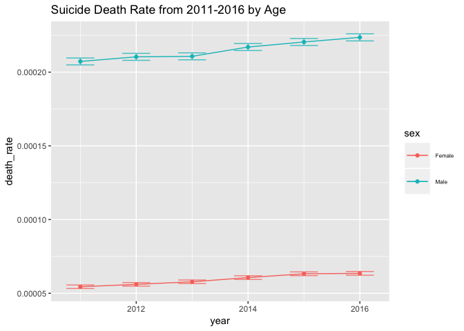
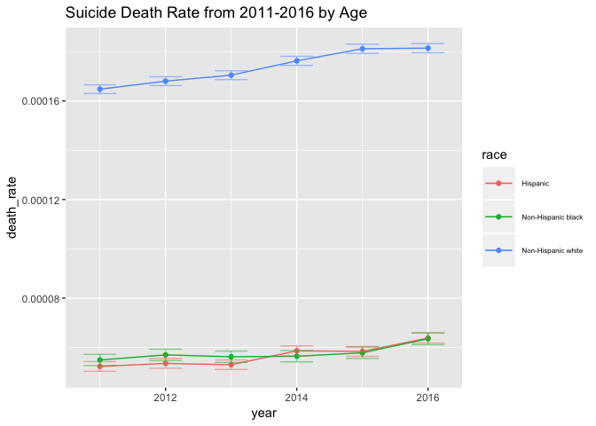

p8105\_fp\_ds100\_dataprocess
================
Yue Gu, Jianghui Lin, Junyuan Zheng, Jianyou Liu, Zhiqian Fang
11/5/2018

``` r
library(tidyverse)
```

    ## ── Attaching packages ─────────────────────────────────────── tidyverse 1.2.1 ──

    ## ✔ ggplot2 3.0.0     ✔ purrr   0.2.5
    ## ✔ tibble  1.4.2     ✔ dplyr   0.7.8
    ## ✔ tidyr   0.8.1     ✔ stringr 1.3.1
    ## ✔ readr   1.1.1     ✔ forcats 0.3.0

    ## ── Conflicts ────────────────────────────────────────── tidyverse_conflicts() ──
    ## ✖ dplyr::filter() masks stats::filter()
    ## ✖ dplyr::lag()    masks stats::lag()

``` r
data_BRFSS = 
  read_csv(file = './data/brfss_data.csv')
```

    ## Parsed with column specification:
    ## cols(
    ##   .default = col_character(),
    ##   year = col_integer(),
    ##   sample_size = col_integer(),
    ##   data_value = col_double(),
    ##   confidence_limit_low = col_double(),
    ##   confidence_limit_high = col_double(),
    ##   display_order = col_integer()
    ## )

    ## See spec(...) for full column specifications.

``` r
data_IM = 
  read_csv(file = './data/NCHS_-_Injury_Mortality__United_States.csv')
```

    ## Parsed with column specification:
    ## cols(
    ##   Year = col_integer(),
    ##   Sex = col_character(),
    ##   `Age group (years)` = col_character(),
    ##   Race = col_character(),
    ##   `Injury mechanism` = col_character(),
    ##   `Injury intent` = col_character(),
    ##   Deaths = col_integer(),
    ##   Population = col_integer(),
    ##   `Age Specific Rate` = col_double(),
    ##   `Age Specific Rate Standard Error` = col_double(),
    ##   `Age Specific Rate Lower Confidence Limit` = col_double(),
    ##   `Age Specific Rate Upper Confidence Limit` = col_double(),
    ##   `Age Adjusted Rate` = col_double(),
    ##   `Age Adjusted Rate Standard Error` = col_double(),
    ##   `Age Adjusted Rate Lower Confidence Limit` = col_double(),
    ##   `Age Adjusted Rate Upper Confidence Limit` = col_double(),
    ##   Unit = col_character()
    ## )

BRFSS data:

``` r
data_BRFSS_JZ = data_BRFSS %>% 
  janitor::clean_names(.) %>% 
  select(., year, locationabbr, locationdesc, response, sample_size, age_group, gender, race_ethnicity)
```

``` r
data_BRFSS_JZ %>% 
  filter(., age_group != 'NA') %>% 
  group_by(., year, locationdesc, response) %>% 
  summarize(., sum_sample_size = sum(sample_size)) %>% 
  spread(., key = response, value = sum_sample_size) %>% 
  mutate(., prevalence = (Yes / (Yes + No)),
    ci_low = prevalence - qnorm(.975) * sqrt(prevalence * (1 - prevalence) / (Yes + No)),
    ci_high = prevalence + qnorm(.975) * sqrt(prevalence * (1 - prevalence) / (Yes + No))) %>% 
  ggplot(., aes(x = year, y = prevalence, color = locationdesc)) +
  geom_point() +
  geom_line() +
  geom_errorbar(aes(ymax = ci_high, ymin = ci_low), width = 0.05, alpha = 0.5) +
  theme(legend.position = 'right', legend.text = element_text(size=4), legend.box = 'vertical',
        legend.key.size = unit(0.1, 'cm')) +
  ggtitle('Depression Prevalence from 2011-2016 by 54 Areas in US')
```



``` r
data_BRFSS_JZ %>% 
  filter(., age_group != 'NA') %>% 
  group_by(., year, response, age_group) %>% 
  summarize(., sum_sample_size = sum(sample_size)) %>% 
  spread(., key = age_group, value = sum_sample_size) %>% 
  mutate(., '25-44' = (`25-34` + `35-44`),
            '45-64' = (`45-54` + `55-64`)) %>% 
  select(., -'25-34', - '35-44', -'45-54', -'55-64') %>% 
  gather(., key = age, value = sample_size, '18-24':'45-64') %>% 
  spread(., key = response, value = sample_size) %>% 
  mutate(., prevalence = (Yes / (Yes + No)),
    ci_low = prevalence - qnorm(.975) * sqrt(prevalence * (1 - prevalence) / (Yes + No)),
    ci_high = prevalence + qnorm(.975) * sqrt(prevalence * (1 - prevalence) / (Yes + No))) %>% 
  ggplot(., aes(x = year, y = prevalence, color = age)) +
  geom_point() +
  geom_line() +
  geom_errorbar(aes(ymax = ci_high, ymin = ci_low), width = 0.1, alpha = 0.5) + 
  theme(legend.position = 'right', legend.text = element_text(size=6), legend.box = 'vertical',
        legend.key.size = unit(1, 'cm')) +
  ggtitle('Depression Prevalence from 2011-2016 by Age Groups')
```



``` r
data_BRFSS_JZ %>% 
  filter(., gender != 'NA') %>% 
  group_by(., year, gender, response) %>% 
  summarize(., sum_sample_size = sum(sample_size)) %>% 
  spread(., key = response, value = sum_sample_size) %>% 
  mutate(., prevalence = (Yes / (Yes + No)),
    ci_low = prevalence - qnorm(.975) * sqrt(prevalence * (1 - prevalence) / (Yes + No)),
    ci_high = prevalence + qnorm(.975) * sqrt(prevalence * (1 - prevalence) / (Yes + No))) %>% 
  ggplot(., aes(x = year, y = prevalence, color = gender)) +
  geom_point() +
  geom_line() +
  geom_errorbar(aes(ymax = ci_high, ymin = ci_low), width = 0.5, alpha = 1) +
  theme(legend.position = 'right', legend.text = element_text(size=6), legend.box = 'vertical',
        legend.key.size = unit(1, 'cm')) +
  ggtitle('Depression Prevalence from 2011-2016 by Genders')
```



``` r
data_BRFSS_JZ %>% 
  filter(., race_ethnicity != 'NA') %>% 
  group_by(., year, response, race_ethnicity) %>% 
  summarize(., sum_sample_size = sum(sample_size)) %>% 
  spread(., key = race_ethnicity, value = sum_sample_size) %>%
  mutate(., Other = sum(c(`American Indian or Alaskan Native, non-Hispanic`, 
                         `Asian, non-Hispanic`, `Multiracial, non-Hispanic`,
                  `Native Hawaiian or other Pacific Islander, non-Hispanic`,
                                                     `Other, non-Hispanic`), na.rm = TRUE)) %>%   select(., -'American Indian or Alaskan Native, non-Hispanic',
            - 'Asian, non-Hispanic', -'Multiracial, non-Hispanic',
            -'Native Hawaiian or other Pacific Islander, non-Hispanic',
            -'Other, non-Hispanic') %>%
  gather(., key = race, value = sample_size, 'Black, non-Hispanic':'Other') %>% 
  spread(., key = response, value = sample_size) %>% 
  mutate(., prevalence = (Yes / (Yes + No)),
    ci_low = prevalence - qnorm(.975) * sqrt(prevalence * (1 - prevalence) / (Yes + No)),
    ci_high = prevalence + qnorm(.975) * sqrt(prevalence * (1 - prevalence) / (Yes + No))) %>%
  mutate(., race = forcats::fct_relevel(race,
                     c('Hispanic', 'Black, non-Hispanic', 'White, non-Hispanic', 'Other'))) %>%
  ggplot(., aes(x = year, y = prevalence, color = race)) +
  geom_point() +
  geom_line() +
  geom_errorbar(aes(ymax = ci_high, ymin = ci_low), width = 0.1, alpha = 0.8) + 
  theme(legend.position = 'right', legend.text = element_text(size=6), legend.box = 'vertical',
        legend.key.size = unit(1, 'cm')) +
  ggtitle('Depression Prevalence from 2011-2016 by Race')
```



IM data:

``` r
data_IM_JZ = data_IM %>% 
  janitor::clean_names(.) %>% 
  filter(., injury_intent == 'Suicide',
    year == 2011 | year == 2012 | year == 2013 | year == 2014 | year == 2015 | year == 2016,
    sex != 'Both sexes',
    age_group_years != 'All Ages',
    race != 'All races',
    injury_mechanism == 'All Mechanisms')

data_IM_JZ %>% 
  select(., injury_mechanism) %>% 
  distinct(.)
```

    ## # A tibble: 1 x 1
    ##   injury_mechanism
    ##   <chr>           
    ## 1 All Mechanisms

``` r
data_IM_JZ %>% 
  group_by(., year, age_group_years) %>% 
  summarize(., sum_deaths = sum(deaths), population = sum(population)) %>% 
  spread(., key = age_group_years, value = sum_deaths) %>%
  mutate_all(funs(ifelse(is.na(.), 0, .))) %>%
  mutate(., '< 25' = (`< 15` + `15–24`),
            '> 64' = (`65–74` + `75+`)) %>% 
  select(., -'< 15', - '15–24', -'65–74', -'75+') %>%
  gather(., key = age, value = deaths, '25–44':'> 64') %>%
  filter(., deaths != 0) %>% 
  group_by(., year, age) %>% 
  summarize(., deaths = sum(deaths), population = sum(population)) %>% 
  mutate(., death_rate = (deaths / population),
    ci_low = death_rate - qnorm(.975) * sqrt(death_rate * (1 - death_rate) / population),
    ci_high = death_rate + qnorm(.975) * sqrt(death_rate * (1 - death_rate) / population)) %>%
  mutate(., age = forcats::fct_relevel(age, c('< 25', '25–44', '45–64', '> 64'))) %>% 
  ggplot(., aes(x = year, y = death_rate, color = age)) +
  geom_point() +
  geom_line() +
  geom_errorbar(aes(ymax = ci_high, ymin = ci_low), width = 0.1, alpha = 0.8) + 
  theme(legend.position = 'right', legend.text = element_text(size=6), legend.box = 'vertical',
        legend.key.size = unit(1, 'cm')) +
  ggtitle('Suicide Death Rate from 2011-2016 by Age')
```


``` r
data_IM_JZ %>% 
  group_by(., year, sex) %>% 
  summarize(., sum_deaths = sum(deaths), population = sum(population)) %>% 
  mutate(., death_rate = (sum_deaths / population),
    ci_low = death_rate - qnorm(.975) * sqrt(death_rate * (1 - death_rate) / population),
    ci_high = death_rate + qnorm(.975) * sqrt(death_rate * (1 - death_rate) / population)) %>% 
  ggplot(., aes(x = year, y = death_rate, color = sex)) +
  geom_point() +
  geom_line() +
  geom_errorbar(aes(ymax = ci_high, ymin = ci_low), width = 0.5, alpha = 0.8) + 
  theme(legend.position = 'right', legend.text = element_text(size=6), legend.box = 'vertical',
        legend.key.size = unit(1, 'cm')) +
  ggtitle('Suicide Death Rate from 2011-2016 by Age')
```



``` r
data_IM_JZ %>% 
  group_by(., year, race) %>%
  summarize(., sum_deaths = sum(deaths), population = sum(population)) %>% 
  mutate(., death_rate = (sum_deaths / population),
    ci_low = death_rate - qnorm(.975) * sqrt(death_rate * (1 - death_rate) / population),
    ci_high = death_rate + qnorm(.975) * sqrt(death_rate * (1 - death_rate) / population)) %>% 
  ggplot(., aes(x = year, y = death_rate, color = race)) +
  geom_point() +
  geom_line() +
  geom_errorbar(aes(ymax = ci_high, ymin = ci_low), width = 0.5, alpha = 0.5) + 
  theme(legend.position = 'right', legend.text = element_text(size=6), legend.box = 'vertical',
        legend.key.size = unit(1, 'cm')) +
  ggtitle('Suicide Death Rate from 2011-2016 by Age')
```


