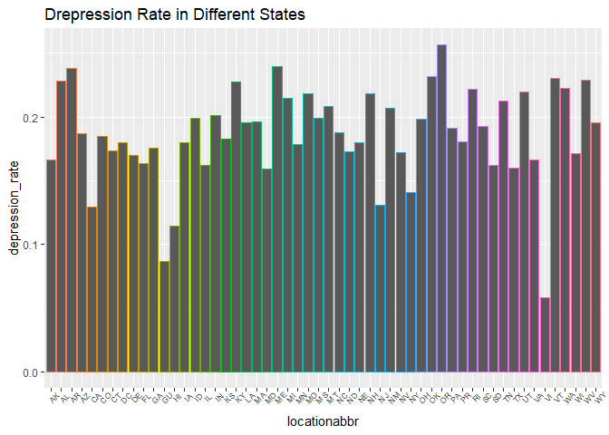
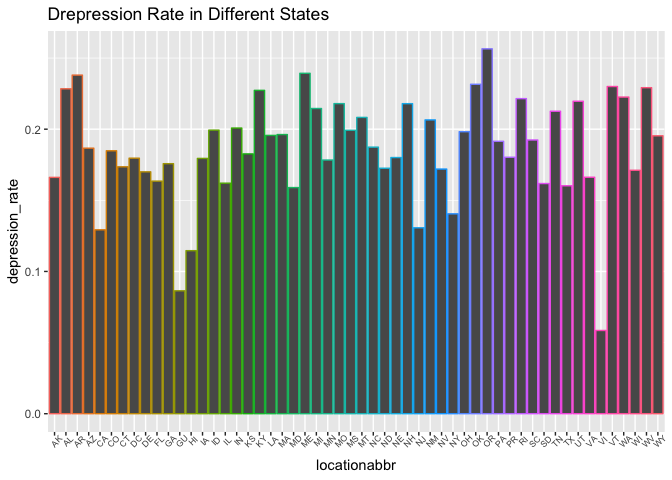

p8105\_fp\_ds100\_Report
================
Yue Gu (yg2625), Jianghui Lin (jl5172), Junyuan Zheng (jz3036), Jianyou Liu (jl5296), Zhiqian Fang (zf2212)
12/3/2018

Motivation:
===========

Suicide is a leading cause of death in the US. Suicide rates increased in nearly every state from 1999 through 2016. Mental health conditions are often seen as the cause of suicide, but suicide is rarely caused by any single factor. In fact, many people who died by suicide are not known to have a diagnosed mental health condition at the time of death. We are interested in examining the variations of suicide death rates among different categorical variables such as gender, race, age group, and to test if the observed differences are statistically significant combined with the analysis to suicide death rate and related confidence interval.

Related work:
=============

Suicide has ranked as the 10th leading cause of death among Americans for many years. <https://www.verywellmind.com/suicide-rates-overstated-in-people-with-depression-2330503>

Initial questions:
==================

The initial thought of this project is to discover the relationship between suicide and people's mental status. We have found two separated datasets, in which one is the Injury Mortality data in the US, the other contains people's depression status in the US. Since both of the two datasets contain information for age, race, and gender, we decided to compare the trend of suicide death rates with depression prevalence under these three categories.

Data:
=====

BRFSS Prevalence Data (2011 to present)
---------------------------------------

Data from the Behavioral Risk Factor Surveillance System (BRFSS) Prevalence Data (2011 to present) were accessed from cdc.gov.(<https://chronicdata.cdc.gov/Behavioral-Risk-Factors/Behavioral-Risk-Factor-Surveillance-System-BRFSS-P/dttw-5yxu>) The version of the data that we will use in this analysis can be found in our Github (./data).

Methodology: <http://www.cdc.gov/brfss/factsheets/pdf/DBS_BRFSS_survey.pdf>

Glossary: <http://apps.nccd.cdc.gov/BRFSSQuest/index.asp>

### Data acquisition and description

As the original dataset is too large, we download the dataset and acquire the data we need. The specific data to be used in this project was accessed in December 2018 using the code below.

``` r
library(tidyverse)

data_BRFSS = 
  read_csv(file='./data/Behavioral_Risk_Factor_Surveillance_System__BRFSS__Prevalence_Data__2011_to_present_.csv')

data_BRFSS %>% 
  select(., Question) %>%
  distinct(.,)

brfss_data = brfss_raw %>% 
   filter(year %in% c(2011, 2012, 2013, 2014, 2015, 2016),
          break_out_category %in% c("Age Group", "Race/Ethnicity", "Gender")) %>% 
   spread(key = break_out_category, break_out)
```

The original dataset contains 1,386,855 rows and 27 column. For further use, we make a preliminary dataset. The preliminary dataset contains 8931 rows and 14 columns. We save the preliminary dataset in our data file. The complete data dictionary is linked above.

Further cleaning
----------------

``` r
# load the preliminary dataset
brfss_data = read.csv("./data/brfss_data.csv") 
# method 1 - select the columns we need
brfss_tidy = brfss_data %>% 
  select(year, locationabbr, locationdesc, response, sample_size, data_value, Age.Group, Gender, Race.Ethnicity, geo_location) 
# method 2 - create age dataset
brfss_age = brfss_data %>% 
  select(year, locationabbr, locationdesc, response, sample_size, data_value, Age.Group) %>% 
  filter(!is.na(Age.Group)) %>% 
  janitor::clean_names()
# create race dataset
brfss_race = brfss_data %>% 
  select(year, locationabbr, locationdesc, response, sample_size, data_value, Gender) %>% 
  filter(!is.na(Gender)) %>% 
  janitor::clean_names()
# create gender dataset
brfss_gender = brfss_data %>% 
  select(year, locationabbr, locationdesc, response, sample_size, data_value, Race.Ethnicity) %>% 
  filter(!is.na(Race.Ethnicity)) %>% 
  janitor::clean_names()
```

As we will do our following analysis by age, race, and gender, we created three tidy subsets by age, race, and gender.

Injury Data Cleaning
--------------------

``` r
 injury_data = read_csv("./data/NCHS_-_Injury_Mortality__United_States.csv") %>% 
  janitor::clean_names() %>%   # tidy the variable names
  #distinct(year, sex,race,age_group_years, injury_intent, .keep_all = TRUE) %>% 
  filter(injury_intent == "Suicide", year %in% c(2011, 2012, 2013, 2014, 2015, 2016),
          sex != 'Both sexes',age_group_years != 'All Ages',race != 'All races',injury_mechanism == 'All Mechanisms') %>% 
  arrange(year) # filtering out data for suicide 
                # filtering only data from 2011-2016 for further comparison analysis with another dataset.
```

The original dataset contains 98280 rows and 17 columns. For further use, we make a preliminary dataset. The preliminary dataset contains 504 rows and 7 columns. Each row includes the information of the mortality rate for specific age,sex,gender group who attempted suicide during specific year.

Exploratory analysis:
=====================

Creat a new data from the original data just for this section, so that it won't affect other part of the analysis: For BRFSS dataset, select some variables (year, locationabbr, locationdesc, response, sample\_size, age\_group, gender, race\_ethnicity) that might be usful for later analysis.

For the Injury Mortality dataset, filter out 'Suicide' as our focus. Get rid of summarized rows for age, sex and race. Since the cases and total population do not differ by 'injury\_mechanism', here I use 'All Mechanisms' to prevend over counting for the population.

Exploring by 'Age':
-------------------


First thing I did is to combine ages to make the two dataset compariable. One defect of this analysis is that the BRFSS data only includes 18-24 age group compared to '&lt; 25' age group in the mortality dataset. If we just look at the other three age groups, for people from 25-64, high prevalence of depression seems to be consistant with suicide death rate. However, regardless of age group '65+' having a relative low depression prevalence, their suicide rate remains relatively high.
When using the 'str\_replace' function for '75+', the result kept giving me an extra '+' at the end of the string. So I set '65+' for the '45–64' group so that they can combine to become the '65+' group.
For both Prevalence and Death Rate, 5% CI were calculated. Usually large CI stands for a relatively small sample size.
Another thing that is worth noticing is that in the raw dataset, the '–' in between '45–64' is not the usual '-' in the keyboard, So I had to copy and paste the symble to my code.

Exploring by 'Race':
--------------------


Race categories other than White, Black, and Hispanic were combined into 'Other'. Here we see White category has both high depression prevalence as well as suicide rate.

Exploring by 'Gender':
----------------------


Surprisingly, even female appears to have more depression, their suicide rate is much lower than male. Could this give a hint that women are more endurable to depression?

Regression Model Analysis
-------------------------

To maintain comparability between injury mechanism and depression(brfss) data, we only generate statistic results for:

-   race:
    -   Hispanic*(baseline)*
    -   Non-Hispanic Black
    -   Non-Hispanic White
-   age groups(in years):
    -   &lt; 25*(baseline)*
    -   25-44
    -   45-64
    -   65+
-   sex/gender:
    -   = 0 if male*(baseline)*
    -   = 1 if female
-   year:
    -   2011*(baseline)*
    -   2012
    -   2013
    -   2014
    -   2015
    -   2016

### Suicide rate model

| term                     |  estimate|  p.value|
|:-------------------------|---------:|--------:|
| (Intercept)              |     7.840|    0.000|
| sex: 1                   |   -12.565|    0.000|
| race: Non-Hispanic black |    -0.912|    0.399|
| race: Non-Hispanic white |    10.313|    0.000|
| age group years: 25–44   |     7.475|    0.000|
| age group years: 45–64   |     7.531|    0.000|
| age group years: 65+     |     6.362|    0.000|
| year: 2012               |     0.212|    0.890|
| year: 2013               |     0.215|    0.888|
| year: 2014               |     0.707|    0.644|
| year: 2015               |     0.778|    0.611|
| year: 2016               |     1.050|    0.492|

### Suicide Model Analysis

Using injury data, we first calculate **suicide death rate = (Deaths  Population) \* 100000** which represents the number of deaths caused by suicide per 100,000 units population. Then, we transform sex, race, age, year into factor variables for future regression model building.

Then, we construct regression for suicide death rate as response, sex, race, age(in years), year as predictor. By observing the coefficients estimates and p-values, there is several interesting finds for suicide death rates:

**Suicide Death Rate = 7.84 - 12.565 I{sex = female} - 0.912 I{race = Non-Hispanic black} + 10.313 I{race = Non-Hispanic white} + 7.745 I{25 &lt; age &lt; 44} + 7.531 I{45 &lt; age &lt; 64} + 6.362 I{age &gt;= 65} + 0.212 I{year = 2012} + 0.215 I{year = 2013} + 0.707 I{year = 2014} + 0.778 I{year = 2015} + 1.05 I{year = 2016}**

1.  sex has **significant** p-value &lt; 0.0001: there is significant difference of suicide rate between male and female group and female tends to have lower suicide death rate.
2.  race of Non-Hispanic white has **significant** p-value: there is significant difference of suicide rate between Non-hispanic Whites and Hispanic and Non-hispanic Black have non-significant difference with Hispanic. Whites tend to have higher suicide death rate compared to Hispanic and Blacks.
3.  all groups of age(in years) have **significant** p-value: there is significant difference between all age groups with baseline age group(age &lt; 25).
4.  all years have **non-significant** p-value: there is not significant difference between all years with year 2011.
5.  the model produced an adjusted *R*<sup>2</sup> = 0.6405, which represents there are 64% of the variability of the suicide rate are explained by the fitted model and data after adjusted and it's a acceptable proportion for the model.

#### Pairwise comparison

    ##   Tukey multiple comparisons of means
    ##     95% family-wise confidence level
    ## 
    ## Fit: aov(formula = .)
    ## 
    ## $sex
    ##          diff       lwr       upr p adj
    ## 1-0 -12.56459 -14.30119 -10.82799     0
    ## 
    ## $race
    ##                                             diff       lwr       upr
    ## Non-Hispanic black-Hispanic           -0.9120358 -3.458863  1.634791
    ## Non-Hispanic white-Hispanic           10.3133176  7.766490 12.860145
    ## Non-Hispanic white-Non-Hispanic black 11.2253534  8.678526 13.772180
    ##                                           p adj
    ## Non-Hispanic black-Hispanic           0.6751966
    ## Non-Hispanic white-Hispanic           0.0000000
    ## Non-Hispanic white-Non-Hispanic black 0.0000000
    ## 
    ## $age_group_years
    ##                    diff       lwr       upr     p adj
    ## 25–44-<25    7.47502573  4.052757 10.897295 0.0000003
    ## 45–64-<25    7.53077512  4.108506 10.953044 0.0000002
    ## 65+-<25      6.36248653  3.568216  9.156757 0.0000001
    ## 45–64-25–44  0.05574939 -3.895946  4.007445 0.9999824
    ## 65+-25–44   -1.11253920 -4.534808  2.309730 0.8342908
    ## 65+-45–64   -1.16828858 -4.590557  2.253980 0.8130266
    ## 
    ## $year
    ##                  diff       lwr      upr     p adj
    ## 2012-2011 0.212133477 -4.176897 4.601164 0.9999927
    ## 2013-2011 0.215043989 -4.173987 4.604074 0.9999922
    ## 2014-2011 0.706522705 -3.682508 5.095553 0.9973082
    ## 2015-2011 0.778233496 -3.610797 5.167264 0.9957454
    ## 2016-2011 1.049947338 -3.339083 5.438978 0.9831005
    ## 2013-2012 0.002910512 -4.386120 4.391941 1.0000000
    ## 2014-2012 0.494389228 -3.894641 4.883420 0.9995197
    ## 2015-2012 0.566100019 -3.822930 4.955131 0.9990719
    ## 2016-2012 0.837813860 -3.551217 5.226844 0.9939877
    ## 2014-2013 0.491478716 -3.897552 4.880509 0.9995334
    ## 2015-2013 0.563189507 -3.825841 4.952220 0.9990948
    ## 2016-2013 0.834903348 -3.554127 5.223934 0.9940845
    ## 2015-2014 0.071710791 -4.317320 4.460741 1.0000000
    ## 2016-2014 0.343424632 -4.045606 4.732455 0.9999199
    ## 2016-2015 0.271713841 -4.117317 4.660744 0.9999749

Then, we make pairwise comparison with Bonferroni and Tukey for race, age and year groups. Findings:
1. **Race**: Non-Hispanic White and Hispanic, Non-Hispanic White and Black have significant different suicide death rate. White have the highest suicide death rate among 3 race groups. And Blacks have smaller suicide death rate compared to Hispanic and Whites.
2. **Age**: 25-44 and &lt;25, 45-64 and &lt;25, 65+ and &lt;25 have significant different suicide death rate. Age groups that are &gt;25 all have higher suicide death rate compared to age &lt;25. And age 65+ have smaller suicide death rate compared to 25-44, 45-64 groups.
3. **Year**: All pairwise comparison for years don't generate significant result, meaning there is no significant different suicide death rate in different years.

### Depression model

#### Age model

| term              |  estimate|  p.value|
|:------------------|---------:|--------:|
| (Intercept)       |    16.486|        0|
| age\_group: 25-44 |     2.310|        0|
| age\_group: 45-64 |     4.528|        0|
| age\_group: 65+   |    -2.125|        0|

##### Pairwise comparison

    ##   Tukey multiple comparisons of means
    ##     95% family-wise confidence level
    ## 
    ## Fit: aov(formula = .)
    ## 
    ## $age_group
    ##                  diff       lwr       upr p adj
    ## 25-44-<25    2.310023  1.598922  3.021124     0
    ## 45-64-<25    4.528117  3.817016  5.239218     0
    ## 65+-<25     -2.125364 -2.944523 -1.306204     0
    ## 45-64-25-44  2.218094  1.642109  2.794080     0
    ## 65+-25-44   -4.435386 -5.140451 -3.730321     0
    ## 65+-45-64   -6.653481 -7.358546 -5.948416     0

#### Model Analysis

Because of the data structure of brfss data, the age, gender, race are independent characteristics of the participants to the study, we have to build 3 seperate model for independent analysis. And the data\_value(in %) represents the proportion of people have depression.

**Age Model**:
**Depression Rate = 16.486 + 2.31 I{25 &lt; age &lt; 44} + 4.528 I{45 &lt; age &lt; 64} - 2.125 I{age &gt;= 65}**

1.  There is significant difference in the depression propotion between age group &lt;25 and each other age group including 25-44, 45-64, 65+.
2.  All pairwise comparison showed a significant p-value between each age groups while 25-44, 45-64 ages showed an increased depression proportion and 65+ showed a decreased depression proportion.
3.  The adjusted *R*<sup>2</sup> = 0.2617 indicates that 26.17% of variability of the depression proportion is explained by the model only includes age groups as predictor.

#### Gender model

| term        |  estimate|  p.value|
|:------------|---------:|--------:|
| (Intercept) |    13.660|        0|
| gender: 1   |     9.028|        0|

    ##   Tukey multiple comparisons of means
    ##     95% family-wise confidence level
    ## 
    ## Fit: aov(formula = .)
    ## 
    ## $gender
    ##         diff      lwr      upr p adj
    ## 1-0 9.028339 8.472382 9.584295     0

#### Model Analysis

**Gender Model**:
**Depression Rate = 13.66 + 9.028 I{gender = female}**

1.  There is significant difference in the depression propotion between male and female. And female indicates a higher depression proportion than male.
2.  The adjusted *R*<sup>2</sup> = 0.6146 indicates that 61.46% of variability of the depression proportion is explained by the model only includes gender as predictor.

#### Race model

    ## Warning: Outer names are only allowed for unnamed scalar atomic inputs

| term                      |  estimate|  p.value|
|:--------------------------|---------:|--------:|
| (Intercept)               |    17.511|        0|
| race: Black, non-Hispanic |    -1.716|        0|
| race: White, non-Hispanic |     1.901|        0|

    ##   Tukey multiple comparisons of means
    ##     95% family-wise confidence level
    ## 
    ## Fit: aov(formula = .)
    ## 
    ## $race_ethnicity
    ##                                              diff       lwr        upr
    ## Black, non-Hispanic-Hispanic            -1.715592 -2.589486 -0.8416988
    ## White, non-Hispanic-Hispanic             1.900893  1.089433  2.7123529
    ## White, non-Hispanic-Black, non-Hispanic  3.616485  2.766051  4.4669193
    ##                                           p adj
    ## Black, non-Hispanic-Hispanic            1.4e-05
    ## White, non-Hispanic-Hispanic            2.0e-07
    ## White, non-Hispanic-Black, non-Hispanic 0.0e+00

#### Model Analysis

**Race Model**:
**Depression Rate = 17.511 - 1.716 I{race = Black, non-Hispanic} + 1.901 I{race = White, non-Hispanic}**

1.  There is significant difference in the depression propotion between Hispantic and Non-Hispanic Black, Hispantic and Non-Hispanic White.
2.  All pairwise comparison showed a significant p-value between each race groups while Whites have higher depression proportion than Hispanics and Blacks and Blacks have lower depression proportion than Hispanics.
3.  The adjusted *R*<sup>2</sup> = 0.1081 indicates that 10.81% of variability of the depression proportion is explained by the model only includes race groups as predictor.

### Additional Analysis for Location:

<<<<<<< HEAD
 In addition to investigating the trend of depression prevalence under the category of *"Age"*, *"Race"*, and *"Gender"*, we are also interested in examining if there is a difference in depression proportion across states of the U.S. Based on the graph, a remarkable finding is that Virgin Islands has the lowest proportion of depression compared to other locations and the difference is quite significant. According to our research, the state population consists of over 70% Black race, and linking back to our visualizations and regression model results, they are consistent with each other since Blacks tend to have the lowest depression prevalence relative the others race groups included in our analysis.
=======

>>>>>>> 74585d1c142284f6ea3d2ca1d7226578ff3c9209

Discussion:
===========

From 2011 through 2016, the general trend for depression prevalence in US increases from 2011 to 2013, then decreases there after. While on the other hand, suicide death rate appears to be increasing each year. Even if we know that depression is just one causal factor for suicide, we expected to see similar trend for the three groups (age, race, gender). The result are generally as expected with some noticable ones.

People older than 65 have a relatively low prevalence of depression while still keep a high suicide rate. In contrary to Black people who have both low depression prevalence and suicide rate, White people are high in both of the statistics. Women are reported to have higher prevalence of depression compared to men, while keep a relatively low death rate of suicide rate. Any apparent difference of trend on the two plot might suggest other causal factors in the 'causal pies'.

Our results obtained from the regression models agree mostly with the patterns found in the visualization plots stratified by *"Age"*, *"Race"*, and *"Gender"* by looking at the estimated coefficients for each model parameter and comparing their magnitude and signs with the reference factor level. However, by looking at the fitted regression for suicide death rate, it can be observed that the term 'year' is not a significant predictor and thus should be removed from the model. This means that although suicide death rates appears to be gradually increasing from 2011 to 2016, there is not enough statistical evidence to show that the change is significant.

On the other hand, for the simple linear regressions to predict depression prevalence, *"Age"*, *"Race"*, and *"Gender"* are all significant covariates. This supports our conclusion that suicide death rate and depression prevalence do vary among these proposed factors. However, the direct association between depression and suicide may be difficult to test. For rare cases like suicide, case-control study should be a suitable way to conduct the research, while the psychological status like depression are really complicated to detect, especially for suicide cases.
