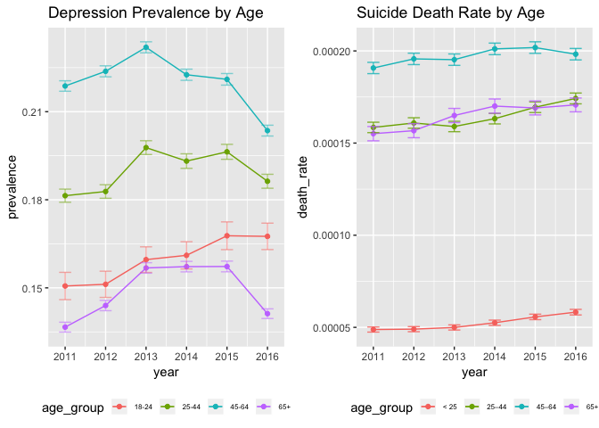
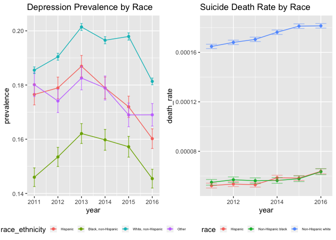
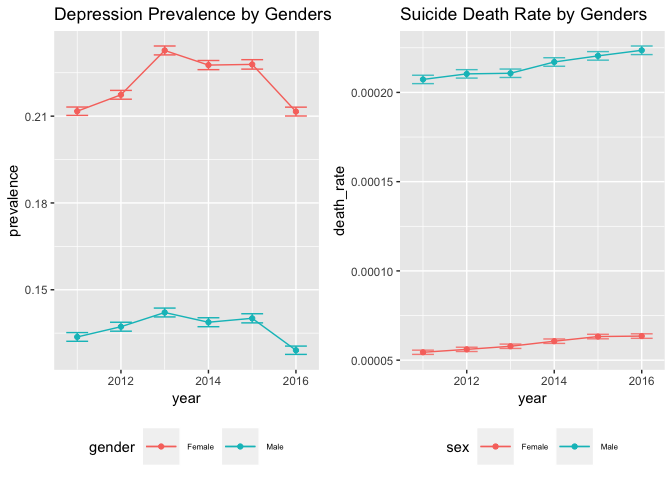

p8105\_fp\_ds100\_Report
================
Yue Gu, Jianghui Lin, Junyuan Zheng, Jianyou Liu, Zhiqian Fang
12/3/2018

Motivation:
===========

Suicide is a leading cause of death in the US. Suicide rates increased in nearly every state from 1999 through 2016. Mental health conditions are often seen as the cause of suicide, but suicide is rarely caused by any single factor. In fact, many people who die by suicide are not known to have a diagnosed mental health condition at the time of death. We are interested in examining the variations of suicide death rates among different categorical variables such as gender, race, age group, and to test if the observed differences are statistically significant combined with the analysis to age-specific rate and related confidence interval.

Related work:
=============

Anything that inspired you, such as a paper, a web site, or something we discussed in class.

Suicide has ranked as the 10th leading cause of death among Americans for many years. <https://www.verywellmind.com/suicide-rates-overstated-in-people-with-depression-2330503>

Initial questions:
==================

The initial thought of this project is to discover the relationship between suicide and people's mental status. We have found two separated datasets, in which one is the Injury Mortality data in the US, the other contains people's depression status in the US. Since both of the two datasets contains information for age, race, and gender, we decided to compare the trend of suicide death rates with depression prevalence under these three categories.

Data:
=====

Source, scraping method, cleaning, etc.

BRFSS Prevalence Data (2011 to present)
---------------------------------------

Data from the Behavioral Risk Factor Surveillance System (BRFSS) Prevalence Data (2011 to present) were accessed from cdc.gov.(<https://chronicdata.cdc.gov/Behavioral-Risk-Factors/Behavioral-Risk-Factor-Surveillance-System-BRFSS-P/dttw-5yxu>) The version of the data that we will use in this analysis can be found in our Github (./data).

Methodology: <http://www.cdc.gov/brfss/factsheets/pdf/DBS_BRFSS_survey.pdf>

Glossary: <http://apps.nccd.cdc.gov/BRFSSQuest/index.asp>

### Data acquisition and description

As the original dataset is too large, we download the dataset and acquire the data we need. The specific data to be used in this project was accessed in December 2018 using the code below.

The original dataset contains 1,386,855 rows and 27 column. For further use, we make a preliminary dataset. The preliminary dataset contains 8931 rows and 14 columns. We save the preliminary dataset in our data file. The complete data dictionary is linked above.

Further cleaning
----------------

As we will do our followin analysis by age, race, and gender, we created three tidy subsets by age, race, and gender.

    ## Parsed with column specification:
    ## cols(
    ##   Year = col_integer(),
    ##   Sex = col_character(),
    ##   `Age group (years)` = col_character(),
    ##   Race = col_character(),
    ##   `Injury mechanism` = col_character(),
    ##   `Injury intent` = col_character(),
    ##   Deaths = col_integer(),
    ##   Population = col_integer(),
    ##   `Age Specific Rate` = col_double(),
    ##   `Age Specific Rate Standard Error` = col_double(),
    ##   `Age Specific Rate Lower Confidence Limit` = col_double(),
    ##   `Age Specific Rate Upper Confidence Limit` = col_double(),
    ##   `Age Adjusted Rate` = col_double(),
    ##   `Age Adjusted Rate Standard Error` = col_double(),
    ##   `Age Adjusted Rate Lower Confidence Limit` = col_double(),
    ##   `Age Adjusted Rate Upper Confidence Limit` = col_double(),
    ##   Unit = col_character()
    ## )

The original dataset contains 98280 rows and 17 columns. For further use, we make a preliminary dataset. The preliminary dataset contains 504 rows and 7 columns. Each row includes the information of the mortality rate for specific age,sex,gender group who attempted suicide during specific year.

Exploratory analysis:
=====================

Visualizations, summaries, and exploratory statistical analyses. Justify the steps you took, and show any major changes to your ideas.

Creat a new data from the original data just for this section, so that it won't affect other part of the analysis: For BRFSS dataset, select some variables that might be usful for later analysis:

For the Injury Mortality dataset, filter out 'Suicide' as our focus. Get rid of summarized rows for age, sex and race. Since the cases and total population do not differ by 'injury\_mechanism', here I use 'All Mechanisms' to prevend over counting for the population.

**Exploring by 'Age':**

 First thing I did is to combine ages to make the two dataset compariable. One defect of this analysis is that the BRFSS data only includes 18-24 age group compared to '&lt; 25' age group in the mortality dataset. If we just look at the other three age groups, for people from 25-64, high prevalence of depression seems to be consistant with suicide death rate. However, regardless of age group '65+' having a relative low depression prevalence, their suicide rate remains relatively high.
When using the 'str\_replace' function for '75+', the result kept giving me an extra '+' at the end of the string. So I set '65+' for the '45–64' group so that they can combine to become the '65+' group.
For both Prevalence and Death Rate, 5% CI were calculated. Usually large CI stands for a relatively small sample size.
Another thing that is worth noticing is that in the raw dataset, the '–' in between '45–64' is not the usual '-' in the keyboard, So I had to copy and paste the symble to my code.
**Exploring by 'Race':**

 Race categories other than White, Black, and Hispanic were combined into 'Other'. Here we see White category has both high depression prevalence as well as suicide rate.

**Exploring by 'Gender':**

 Surprisingly, even female appears to have more depression, their suicide rate is much lower than male. Could this give a hint that women are more endurable to depression?

Additional analysis:
====================

If you undertake formal statistical analyses, describe these in detail

Regression Model Analysis
=========================

Suicide rate model
------------------

    ## 
    ## Call:
    ## lm(formula = suicide_dr ~ sex + race + age_group_years + year, 
    ##     data = new_injury)
    ## 
    ## Residuals:
    ##      Min       1Q   Median       3Q      Max 
    ## -18.0264  -3.9721  -0.2391   4.3182  19.5502 
    ## 
    ## Coefficients:
    ##                        Estimate Std. Error t value Pr(>|t|)    
    ## (Intercept)              7.8401     1.4606   5.368 2.16e-07 ***
    ## sex1                   -12.5646     0.8808 -14.265  < 2e-16 ***
    ## raceNon-Hispanic black  -0.9120     1.0787  -0.845    0.399    
    ## raceNon-Hispanic white  10.3133     1.0787   9.561  < 2e-16 ***
    ## age_group_years25–44     7.4750     1.3212   5.658 5.14e-08 ***
    ## age_group_years45–64     7.5308     1.3212   5.700 4.15e-08 ***
    ## age_group_years65+       6.3625     1.0787   5.898 1.51e-08 ***
    ## year2012                 0.2121     1.5256   0.139    0.890    
    ## year2013                 0.2150     1.5256   0.141    0.888    
    ## year2014                 0.7065     1.5256   0.463    0.644    
    ## year2015                 0.7782     1.5256   0.510    0.611    
    ## year2016                 1.0499     1.5256   0.688    0.492    
    ## ---
    ## Signif. codes:  0 '***' 0.001 '**' 0.01 '*' 0.05 '.' 0.1 ' ' 1
    ## 
    ## Residual standard error: 6.472 on 204 degrees of freedom
    ## Multiple R-squared:  0.6589, Adjusted R-squared:  0.6405 
    ## F-statistic: 35.82 on 11 and 204 DF,  p-value: < 2.2e-16

    ## 
    ##  Pairwise comparisons using t tests with pooled SD 
    ## 
    ## data:  new_injury$suicide_dr and new_injury$age_group_years 
    ## 
    ##       <25    25–44  45–64 
    ## 25–44 0.0030 -      -     
    ## 45–64 0.0027 1.0000 -     
    ## 65+   0.0017 1.0000 1.0000
    ## 
    ## P value adjustment method: bonferroni

    ##   Tukey multiple comparisons of means
    ##     95% family-wise confidence level
    ## 
    ## Fit: aov(formula = .)
    ## 
    ## $sex
    ##          diff       lwr       upr p adj
    ## 1-0 -12.56459 -14.30119 -10.82799     0
    ## 
    ## $race
    ##                                             diff       lwr       upr
    ## Non-Hispanic black-Hispanic           -0.9120358 -3.458863  1.634791
    ## Non-Hispanic white-Hispanic           10.3133176  7.766490 12.860145
    ## Non-Hispanic white-Non-Hispanic black 11.2253534  8.678526 13.772180
    ##                                           p adj
    ## Non-Hispanic black-Hispanic           0.6751966
    ## Non-Hispanic white-Hispanic           0.0000000
    ## Non-Hispanic white-Non-Hispanic black 0.0000000
    ## 
    ## $age_group_years
    ##                    diff       lwr       upr     p adj
    ## 25–44-<25    7.47502573  4.052757 10.897295 0.0000003
    ## 45–64-<25    7.53077512  4.108506 10.953044 0.0000002
    ## 65+-<25      6.36248653  3.568216  9.156757 0.0000001
    ## 45–64-25–44  0.05574939 -3.895946  4.007445 0.9999824
    ## 65+-25–44   -1.11253920 -4.534808  2.309730 0.8342908
    ## 65+-45–64   -1.16828858 -4.590557  2.253980 0.8130266
    ## 
    ## $year
    ##                  diff       lwr      upr     p adj
    ## 2012-2011 0.212133477 -4.176897 4.601164 0.9999927
    ## 2013-2011 0.215043989 -4.173987 4.604074 0.9999922
    ## 2014-2011 0.706522705 -3.682508 5.095553 0.9973082
    ## 2015-2011 0.778233496 -3.610797 5.167264 0.9957454
    ## 2016-2011 1.049947338 -3.339083 5.438978 0.9831005
    ## 2013-2012 0.002910512 -4.386120 4.391941 1.0000000
    ## 2014-2012 0.494389228 -3.894641 4.883420 0.9995197
    ## 2015-2012 0.566100019 -3.822930 4.955131 0.9990719
    ## 2016-2012 0.837813860 -3.551217 5.226844 0.9939877
    ## 2014-2013 0.491478716 -3.897552 4.880509 0.9995334
    ## 2015-2013 0.563189507 -3.825841 4.952220 0.9990948
    ## 2016-2013 0.834903348 -3.554127 5.223934 0.9940845
    ## 2015-2014 0.071710791 -4.317320 4.460741 1.0000000
    ## 2016-2014 0.343424632 -4.045606 4.732455 0.9999199
    ## 2016-2015 0.271713841 -4.117317 4.660744 0.9999749

Depression model
----------------

#### Age model

    ## 
    ## Call:
    ## lm(formula = data_value ~ age_group, data = new_brfss_age)
    ## 
    ## Residuals:
    ##      Min       1Q   Median       3Q      Max 
    ## -13.3957  -2.5113   0.0043   2.5862  13.9343 
    ## 
    ## Coefficients:
    ##                Estimate Std. Error t value Pr(>|t|)    
    ## (Intercept)     16.4857     0.2267  72.721  < 2e-16 ***
    ## age_group25-44   2.3100     0.2766   8.353  < 2e-16 ***
    ## age_group45-64   4.5281     0.2766  16.373  < 2e-16 ***
    ## age_group65+    -2.1254     0.3186  -6.671 3.31e-11 ***
    ## ---
    ## Signif. codes:  0 '***' 0.001 '**' 0.01 '*' 0.05 '.' 0.1 ' ' 1
    ## 
    ## Residual standard error: 3.991 on 1894 degrees of freedom
    ## Multiple R-squared:  0.2629, Adjusted R-squared:  0.2617 
    ## F-statistic: 225.2 on 3 and 1894 DF,  p-value: < 2.2e-16

    ##   Tukey multiple comparisons of means
    ##     95% family-wise confidence level
    ## 
    ## Fit: aov(formula = .)
    ## 
    ## $age_group
    ##                  diff       lwr       upr p adj
    ## 25-44-<25    2.310023  1.598922  3.021124     0
    ## 45-64-<25    4.528117  3.817016  5.239218     0
    ## 65+-<25     -2.125364 -2.944523 -1.306204     0
    ## 45-64-25-44  2.218094  1.642109  2.794080     0
    ## 65+-25-44   -4.435386 -5.140451 -3.730321     0
    ## 65+-45-64   -6.653481 -7.358546 -5.948416     0

#### Gender model

    ## 
    ## Call:
    ## lm(formula = data_value ~ gender, data = new_brfss_gender)
    ## 
    ## Residuals:
    ##      Min       1Q   Median       3Q      Max 
    ## -15.8788  -2.0525   0.1596   2.3746  10.0112 
    ## 
    ## Coefficients:
    ##             Estimate Std. Error t value Pr(>|t|)    
    ## (Intercept)  13.6604     0.2002   68.24   <2e-16 ***
    ## gender1       9.0283     0.2831   31.89   <2e-16 ***
    ## ---
    ## Signif. codes:  0 '***' 0.001 '**' 0.01 '*' 0.05 '.' 0.1 ' ' 1
    ## 
    ## Residual standard error: 3.576 on 636 degrees of freedom
    ## Multiple R-squared:  0.6152, Adjusted R-squared:  0.6146 
    ## F-statistic:  1017 on 1 and 636 DF,  p-value: < 2.2e-16

    ##   Tukey multiple comparisons of means
    ##     95% family-wise confidence level
    ## 
    ## Fit: aov(formula = .)
    ## 
    ## $gender
    ##         diff      lwr      upr p adj
    ## 1-0 9.028339 8.472382 9.584295     0

#### Race model

    ## Warning: Outer names are only allowed for unnamed scalar atomic inputs

    ## 
    ## Call:
    ## lm(formula = data_value ~ race_ethnicity, data = new_brfss_race)
    ## 
    ## Residuals:
    ##      Min       1Q   Median       3Q      Max 
    ## -11.9123  -2.7648  -0.3959   2.2608  17.2341 
    ## 
    ## Coefficients:
    ##                                   Estimate Std. Error t value Pr(>|t|)    
    ## (Intercept)                        17.5115     0.2518  69.554  < 2e-16 ***
    ## race_ethnicityBlack, non-Hispanic  -1.7156     0.3722  -4.609 4.68e-06 ***
    ## race_ethnicityWhite, non-Hispanic   1.9009     0.3456   5.500 5.08e-08 ***
    ## ---
    ## Signif. codes:  0 '***' 0.001 '**' 0.01 '*' 0.05 '.' 0.1 ' ' 1
    ## 
    ## Residual standard error: 4.175 on 815 degrees of freedom
    ## Multiple R-squared:  0.1103, Adjusted R-squared:  0.1081 
    ## F-statistic: 50.51 on 2 and 815 DF,  p-value: < 2.2e-16

    ##   Tukey multiple comparisons of means
    ##     95% family-wise confidence level
    ## 
    ## Fit: aov(formula = .)
    ## 
    ## $race_ethnicity
    ##                                              diff       lwr        upr
    ## Black, non-Hispanic-Hispanic            -1.715592 -2.589486 -0.8416988
    ## White, non-Hispanic-Hispanic             1.900893  1.089433  2.7123529
    ## White, non-Hispanic-Black, non-Hispanic  3.616485  2.766051  4.4669193
    ##                                           p adj
    ## Black, non-Hispanic-Hispanic            1.4e-05
    ## White, non-Hispanic-Hispanic            2.0e-07
    ## White, non-Hispanic-Black, non-Hispanic 0.0e+00

Analysis Report
---------------

To maintain comparability between injury mechanism and depression(brfss) data, we only generate statistic results for:

-   race:
    -   Hispanic*(baseline)*
    -   Non-Hispanic Black
    -   Non-Hispanic White
-   age groups(in years):
    -   &lt; 25*(baseline)*
    -   25-44
    -   45-64
    -   65+
-   sex/gender:
    -   = 0 if male*(baseline)*
    -   = 1 if female
-   year:
    -   2011*(baseline)*
    -   2012
    -   2013
    -   2014
    -   2015
    -   2016

### Suicide Model

Using injury data, we first calculate suicide death rate = (Deaths  Population) \* 100000 which represents the number of deaths caused by suicide per 100,000 units population. Then, we transform sex, race, age, year into factor variables for future regression model building.

Then, we construct regression for suicide death rate as response, sex, race, age(in years), year as predictor. By observing the coefficients estimates and p-values, there is several interesting finds for suicide death rates:
1. sex has **significant** p-value &lt; 0.0001: there is significant difference of suicide rate between male and female group and female tends to have lower suicide death rate.
2. race of Non-Hispanic white has **significant** p-value: there is significant difference of suicide rate between Non-hispanic Whites and Hispanic and Non-hispanic Black have non-significant difference with Hispanic. Whites tend to have higher suicide death rate compared to Hispanic and Blacks.
3. all groups of age(in years) have **significant** p-value: there is significant difference between all age groups with baseline age group(age &lt; 25).
4. all years have **non-significant** p-value: there is not significant difference between all years with year 2011.
5. the model produced an adjusted *R*2 = 0.6405, which represents there are 64% of the variability of the suicide rate are explained by the fitted model and data after adjusted and it's a acceptable proportion for the model.

Then, we make pairwise comparison with Bonferroni and Tukey for race, age and year groups. Findings:
1. **Race**: Non-Hispanic White and Hispanic, Non-Hispanic White and Black have significant different suicide death rate. White have the highest suicide death rate among 3 race groups. And Blacks have smaller suicide death rate compared to Hispanic and Whites.
2. **Age**: 25-44 and &lt;25, 45-64 and &lt;25, 65+ and &lt;25 have significant different suicide death rate. Age groups that are &gt;25 all have higher suicide death rate compared to age &lt;25. And age 65+ have smaller suicide death rate compared to 25-44, 45-64 groups.
3. **Year**: All pairwise comparison for years don't generate significant result, meaning there is no significant different suicide death rate in different years.

### Depression Model

Because of the data structure of brfss data, the age, gender, race are independent characteristics of the participants to the study, we have to build 3 seperate model for independent analysis. And the data\_value(in %) represents the proportion of people have depression.

**Age Model**:
1. There is significant difference in the depression propotion between age group &lt;25 and each other age group including 25-44, 45-64, 65+.
2. All pairwise comparison showed a significant p-value between each age groups while 25-44, 45-64 ages showed an increased depression proportion and 65+ showed a decreased depression proportion. 3. The adjusted *R*2 = 0.2617 indicates that 26.17% of variability of the depression proportion is explained by the model only includes age groups as predictor.

**Gender Model**:
1. There is significant difference in the depression propotion between male and female. And female indicates a higher depression proportion than male.
2. The adjusted *R*2 = 0.6146 indicates that 61.46% of variability of the depression proportion is explained by the model only includes gender as predictor.

**Race Model**:
1. There is significant difference in the depression propotion between Hispantic and Non-Hispanic Black, Hispantic and Non-Hispanic White.
2. All pairwise comparison showed a significant p-value between each race groups while Whites have higher depression proportion than Hispanics and Blacks and Blacks have lower depression proportion than Hispanics. 3. The adjusted *R*2 = 0.1081 indicates that 10.81% of variability of the depression proportion is explained by the model only includes race groups as predictor.

### Additional Analysis for Location:

**Location Model**:

#### Location

    ## 
    ## Call:
    ## lm(formula = data_value ~ locationabbr, data = new_brfss_location)
    ## 
    ## Residuals:
    ##    Min     1Q Median     3Q    Max 
    ## -70.19 -32.46  17.36  31.10  47.15 
    ## 
    ## Coefficients:
    ##                Estimate Std. Error t value Pr(>|t|)    
    ## (Intercept)     52.0795     2.6267  19.827   <2e-16 ***
    ## locationabbrAL  -1.0037     3.6783  -0.273   0.7850    
    ## locationabbrAR  -1.3201     3.6842  -0.358   0.7201    
    ## locationabbrAZ  -0.7942     3.6499  -0.218   0.8277    
    ## locationabbrCA  -1.8370     3.6282  -0.506   0.6127    
    ## locationabbrCO  -1.8079     3.6282  -0.498   0.6183    
    ## locationabbrCT  -1.1232     3.6444  -0.308   0.7579    
    ## locationabbrDC   0.6745     3.7210   0.181   0.8562    
    ## locationabbrDE  -0.3059     3.7210  -0.082   0.9345    
    ## locationabbrFL  -0.8257     3.6499  -0.226   0.8210    
    ## locationabbrGA  -1.0166     3.6902  -0.275   0.7830    
    ## locationabbrGU   2.6608     3.8031   0.700   0.4842    
    ## locationabbrHI  -0.6717     3.7085  -0.181   0.8563    
    ## locationabbrIA   0.3229     3.7744   0.086   0.9318    
    ## locationabbrID  -1.6049     3.7605  -0.427   0.6696    
    ## locationabbrIL  -0.3283     3.7085  -0.089   0.9295    
    ## locationabbrIN  -1.4267     3.6611  -0.390   0.6968    
    ## locationabbrKS  -1.7913     3.6499  -0.491   0.6236    
    ## locationabbrKY  -0.9849     3.6842  -0.267   0.7892    
    ## locationabbrLA  -1.1200     3.7147  -0.302   0.7630    
    ## locationabbrMA  -1.4216     3.6611  -0.388   0.6978    
    ## locationabbrMD  -1.1564     3.6444  -0.317   0.7510    
    ## locationabbrME  -1.6176     3.7404  -0.432   0.6654    
    ## locationabbrMI  -1.8709     3.6389  -0.514   0.6072    
    ## locationabbrMN  -1.8913     3.6389  -0.520   0.6033    
    ## locationabbrMO  -1.3637     3.6611  -0.372   0.7095    
    ## locationabbrMS  -0.7819     3.8180  -0.205   0.8377    
    ## locationabbrMT  -1.8526     3.7339  -0.496   0.6198    
    ## locationabbrNC  -1.5185     3.6555  -0.415   0.6779    
    ## locationabbrND  -0.4930     3.8105  -0.129   0.8971    
    ## locationabbrNE  -1.5546     3.6555  -0.425   0.6706    
    ## locationabbrNH  -0.0380     3.7885  -0.010   0.9920    
    ## locationabbrNJ  -0.1616     3.6902  -0.044   0.9651    
    ## locationabbrNM  -1.5157     3.6842  -0.411   0.6808    
    ## locationabbrNV  -0.8684     3.6725  -0.236   0.8131    
    ## locationabbrNY  -1.5356     3.6444  -0.421   0.6735    
    ## locationabbrOH  -1.2405     3.6725  -0.338   0.7355    
    ## locationabbrOK  -1.7938     3.6611  -0.490   0.6242    
    ## locationabbrOR  -1.5649     3.7147  -0.421   0.6736    
    ## locationabbrPA  -1.5138     3.6783  -0.412   0.6807    
    ## locationabbrPR  -1.7694     4.0333  -0.439   0.6609    
    ## locationabbrRI  -1.4663     3.6842  -0.398   0.6906    
    ## locationabbrSC  -1.4500     3.6499  -0.397   0.6912    
    ## locationabbrSD  -0.3590     3.7958  -0.095   0.9246    
    ## locationabbrTN  -0.1111     3.7605  -0.030   0.9764    
    ## locationabbrTX  -1.0115     3.6725  -0.275   0.7830    
    ## locationabbrUT  -0.6714     3.6668  -0.183   0.8547    
    ## locationabbrVA  -0.8111     3.6725  -0.221   0.8252    
    ## locationabbrVI  22.7534     8.9352   2.547   0.0109 *  
    ## locationabbrVT  -1.7315     3.7274  -0.465   0.6423    
    ## locationabbrWA  -1.8983     3.6178  -0.525   0.5998    
    ## locationabbrWI  -0.1239     3.6902  -0.034   0.9732    
    ## locationabbrWV  -1.0851     3.7537  -0.289   0.7725    
    ## locationabbrWY  -1.3778     3.7814  -0.364   0.7156    
    ## ---
    ## Signif. codes:  0 '***' 0.001 '**' 0.01 '*' 0.05 '.' 0.1 ' ' 1
    ## 
    ## Residual standard error: 31.96 on 7941 degrees of freedom
    ## Multiple R-squared:  0.001586,   Adjusted R-squared:  -0.005078 
    ## F-statistic: 0.238 on 53 and 7941 DF,  p-value: 1

From model output, we observe that almost all p-value except for VI are non-significant. However, the model generates a negative adjusted *R*2, which indicates that the explanation towards depression proportion is low or neglibible and it shows the insignificance of explanatory variables for location as predictors, thus, we can't get analytical result for location in the data.

Discussion:
===========

What were your findings? Are they what you expect? What insights into the data can you make?

From 2011 through 2016, the general depression prevalence in US goes up then goes down again. On the other hand, the suicide rate has been increasing each year. Even we know that depression is just one causal factor to suicide, we expected seeing similar trend for the three groups (age, race, gender). The result are generally as expected while there are some noticable ones.
People older than 65 have a relatively low prevalence of depression while still keep a high suicide rate. In contrary to Black people who have both low depression prevalence and suicide rate, White people are high in both of the statistics. Women are reported to have higher prevalence of depression compared to men, while keep a relatively low death rate of suicide rate. Any apparent difference of trend on the two plot might suggest other causal factors in the 'causal pies'. However, the association between depression and suicide is kind of hard to test. For rare cases like suicide, case-control study should be a suitable way to conduct the research, while the psychological status like depression are really complicated to detect, especially for suicide cases.
