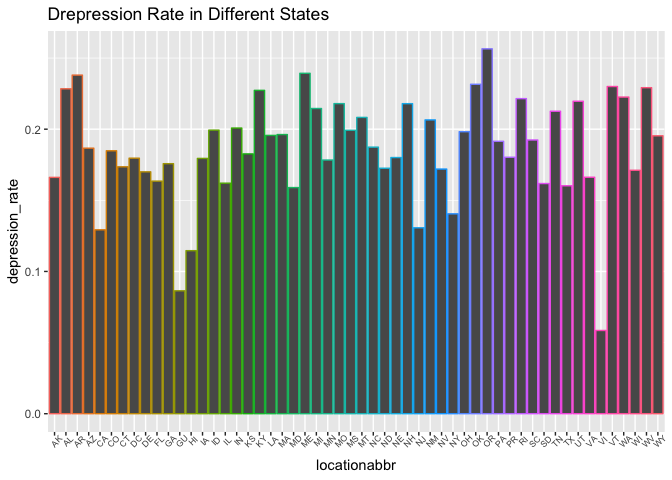

p8105\_fp\_ds100\_jl5172
================

``` r
library(tidyverse)
```

    ## ── Attaching packages ──────────────────────────────────────────────────────────────────── tidyverse 1.2.1 ──

    ## ✔ ggplot2 3.0.0     ✔ purrr   0.2.5
    ## ✔ tibble  1.4.2     ✔ dplyr   0.7.8
    ## ✔ tidyr   0.8.1     ✔ stringr 1.3.1
    ## ✔ readr   1.1.1     ✔ forcats 0.3.0

    ## ── Conflicts ─────────────────────────────────────────────────────────────────────── tidyverse_conflicts() ──
    ## ✖ dplyr::filter() masks stats::filter()
    ## ✖ dplyr::lag()    masks stats::lag()

``` r
brfss<-read.csv("./data/brfss_data.csv")
injury<-read.csv("./data/NCHS_-_Injury_Mortality__United_States.csv")
```

Location

``` r
brfss %>% 
  dplyr::select(locationabbr) %>% 
  distinct() %>% 
  View()     # 54 locations
```

``` r
brfss %>% 
  dplyr::select(locationabbr,response,sample_size,data_value,confidence_limit_low,confidence_limit_high,break_out_category_id,breakout_id) %>%
  filter(break_out_category_id=="CAT3") %>% 
  select(sample_size) %>% 
  sum()    #2852557  AGE
```

    ## [1] 2852557

``` r
brfss %>% 
  dplyr::select(locationabbr,response,sample_size,data_value,confidence_limit_low,confidence_limit_high,break_out_category_id,breakout_id) %>%
  filter(break_out_category_id=="CAT4") %>% 
  select(sample_size) %>% 
  sum()   #2824302 RACE
```

    ## [1] 2824302

``` r
brfss %>% 
  dplyr::select(locationabbr,response,sample_size,data_value,confidence_limit_low,confidence_limit_high,break_out_category_id,breakout_id) %>%
  filter(break_out_category_id=="CAT2") %>% 
  select(sample_size) %>% 
  sum()     #2852500 SEX
```

    ## [1] 2852500

Since the sample size for CAT2: SEX is largest among three. I decided to go with CAT2.

``` r
location_depression<-brfss %>% 
  dplyr::select(year,locationabbr,locationdesc,response,sample_size,data_value,confidence_limit_low,confidence_limit_high,break_out_category_id,breakout_id,Gender) %>%
  filter(break_out_category_id=="CAT2",response=="Yes") %>% 
mutate(total_sample_size=ceiling(sample_size/(data_value/100))) %>% 
  rename(depress_num=sample_size,depress_rate= data_value) %>% 
  group_by(locationabbr) %>% 
  summarize(total_dep=sum(depress_num,na.rm=T),total_sam=sum(total_sample_size,na.rm=T))
```

``` r
location_depression=location_depression %>% 
  mutate(depression_rate=total_dep/total_sam)

location_depression %>% 
  ggplot(aes(x=locationabbr,y=depression_rate,color=locationabbr))+
  labs(title="Drepression Rate in Different States")+
  geom_col()+
  theme(axis.text.x = element_text(angle = 45,size = 6.5),legend.position = "none")
```


