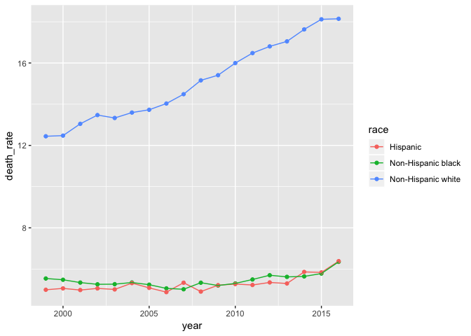
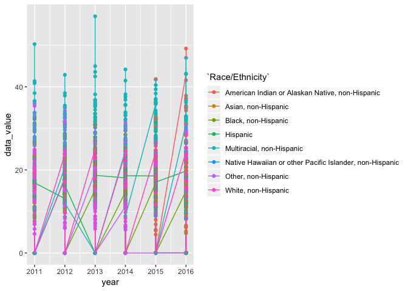

p8105\_fp\_ds100\_zf2212
================
Catherine
11/30/2018

``` r
library(tidyverse)
```

    ## ── Attaching packages ───────────────────────────────────────────────────────── tidyverse 1.2.1 ──

    ## ✔ ggplot2 3.0.0     ✔ purrr   0.2.5
    ## ✔ tibble  1.4.2     ✔ dplyr   0.7.6
    ## ✔ tidyr   0.8.1     ✔ stringr 1.3.1
    ## ✔ readr   1.1.1     ✔ forcats 0.3.0

    ## ── Conflicts ──────────────────────────────────────────────────────────── tidyverse_conflicts() ──
    ## ✖ dplyr::filter() masks stats::filter()
    ## ✖ dplyr::lag()    masks stats::lag()

``` r
nchs_raw = read_csv("data/NCHS_-_Injury_Mortality__United_States.csv") %>% janitor::clean_names()
```

    ## Parsed with column specification:
    ## cols(
    ##   Year = col_integer(),
    ##   Sex = col_character(),
    ##   `Age group (years)` = col_character(),
    ##   Race = col_character(),
    ##   `Injury mechanism` = col_character(),
    ##   `Injury intent` = col_character(),
    ##   Deaths = col_integer(),
    ##   Population = col_integer(),
    ##   `Age Specific Rate` = col_double(),
    ##   `Age Specific Rate Standard Error` = col_double(),
    ##   `Age Specific Rate Lower Confidence Limit` = col_double(),
    ##   `Age Specific Rate Upper Confidence Limit` = col_double(),
    ##   `Age Adjusted Rate` = col_double(),
    ##   `Age Adjusted Rate Standard Error` = col_double(),
    ##   `Age Adjusted Rate Lower Confidence Limit` = col_double(),
    ##   `Age Adjusted Rate Upper Confidence Limit` = col_double(),
    ##   Unit = col_character()
    ## )

``` r
nchs_suicide = nchs_raw %>% 
  mutate(death_rate = round((deaths/population)*100000, digits = 3)) %>% 
  select(year, race, sex, age_group_years, injury_mechanism, injury_intent, death_rate) %>%
  filter(!race == "All races",
         injury_mechanism == "All Mechanisms",
         age_group_years == "All Ages",
         sex == "Both sexes",
         injury_intent == "Suicide") %>% 
  group_by(year, injury_intent) 
```

``` r
nchs_suicide %>% ggplot(aes(x = year, y = death_rate, color = race)) +
  geom_point() +
  geom_line()
```



Non-Hispanic White has the highest deaths rate of suicide compared to two other race groups. As this is the death rate of suicide, we need to take a look if we can find some connection to depression or other.

**Research**: Depression is involved in more than two-thirds of the 30,000 suicides that occur in the United States every year. For every two homicides, there are three suicides. "Elderly men may feel especially hopeless when their bodies break down with illness because it can destroy their sense of masculinity," says Lieberman. That may be why the highest suicide rate among Americans is in white men who are 85 or older, many of whom may have a depressive illness.

*reference*: <https://www.everydayhealth.com/hs/major-depression/depression-statistics/>

``` r
brfss_raw = read_csv("./data/brfss_data.csv")
```

    ## Parsed with column specification:
    ## cols(
    ##   .default = col_character(),
    ##   year = col_integer(),
    ##   sample_size = col_integer(),
    ##   data_value = col_double(),
    ##   confidence_limit_low = col_double(),
    ##   confidence_limit_high = col_double(),
    ##   display_order = col_integer()
    ## )

    ## See spec(...) for full column specifications.

``` r
brfss = brfss_raw %>% 
  filter(response == "Yes") %>%
  filter(!is.na(`Race/Ethnicity`)) %>% 
  select(year, response, data_value, `Race/Ethnicity`, location_id) %>% 
  group_by(`Race/Ethnicity`)
brfss[is.na(brfss)] = 0

brfss %>% ggplot(aes(x = year, y = data_value, color = `Race/Ethnicity`)) + 
  geom_point() +
  geom_line() 
```


